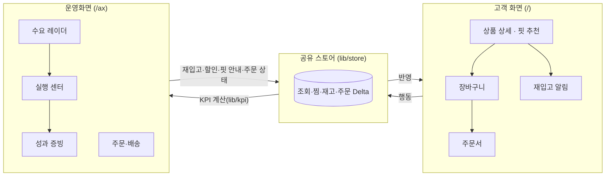

# MORFIT — 패션·의류 AX + 멀티브랜드 플랫폼 (DEMO)

> 고객의 조회·검색·찜·사이즈·구매·반품 데이터를 **상품 옵션 단위의 수요신호**로 바꾸고,
> 이를 MD·재고·할인·재구매 판단에 연결하는 **Business AX + Customer Platform Hybrid**.
> 미래AI랩 AX + Platform Unified Design & Development System v3.0 기반 · 가상 브랜드 · 모든 데이터는 DEMO.

## 빠른 시작

```bash
nvm use            # Node 22 (.nvmrc)
npm ci
npm run dev        # http://localhost:3000  (고객 화면)  ·  /ax (운영화면)
```

외부 서비스 없이 바로 동작합니다. 데이터는 브라우저에서 결정론적 시드로 만들고 `localStorage`에 저장합니다(설정 → 데모 초기화로 처음 상태 복원). AI 설명은 `ANTHROPIC_API_KEY`가 있을 때만 서버 Route(`/api/ai/explain`)에서 호출합니다(`.env.example`).

## 기술 스택

| 영역 | 선택 | 이유 |
|---|---|---|
| 프레임워크 | Next.js 15 App Router · React 19 · TypeScript strict | 라우트별 메타데이터·오류 경계·이미지 라우트를 프레임워크 규칙으로 |
| 상태 | Zustand + persist | 고객 화면과 운영화면이 **같은 스토어**를 읽고 써서 순환(Loop)이 실제로 돈다 |
| 스타일 | Tailwind CSS 3 + CSS 변수 토큰 | 테마 9종·글자 크기 3단계를 토큰 교체만으로 |
| 차트 | Recharts | 운영화면 전용(고객 화면 번들에는 포함되지 않음) |
| 테스트 | Vitest(도메인) · Playwright(흐름·레이아웃·접근성) | 계산은 단위 테스트, 화면은 실제 브라우저로 |

## 구조



```
src/app/(customer)/…     고객 화면 라우트 (각 세그먼트 layout.tsx = 탭 제목·설명)
src/app/ax/…             운영화면 라우트 (제목은 메뉴 정의 AX_NAV에서)
src/components/ui        공통 UI (Button · Overlay(포커스 관리) · DataTable · Toast …)
src/lib/types.ts         데이터 모델 (SSOT)
src/lib/demo/seed.ts     결정론적 데모 시드 — Scenario A~D 내장
src/lib/store.ts         공유 스토어 (Customer ↔ AX Closed Loop)
src/lib/kpi.ts           KPI·재고상태·수요 점수·재입고 우선순위 (규칙 계산)
src/lib/pricing.ts       주문 금액 규칙 — 화면과 저장이 같은 함수 (D-42)
src/lib/validation.ts    입력 검증 규칙·문구 (주문서·핏 프로필)
src/lib/orderMemo.ts     주문 메모 저장 형식 ↔ 화면 항목
src/lib/meta.ts          라우트 메타데이터 도우미
src/lib/engine.ts        규칙 엔진: 핏 추천 · 재구매 추천 · 브리핑
```

## 품질 관리

| 명령 | 내용 |
|---|---|
| `npm run check` | 타입 검사 + ESLint + Prettier 형식 + 단위 테스트 (CI와 동일) |
| `npm test` | Vitest — 금액·검증·메모·KPI·스토어 순환 (`src/lib/__tests__`) |
| `npm run qa:flows` | 실제 사용 흐름·예외 E2E (Playwright, 프로덕션 서버 대상) |
| `npm run qa:journey` | 전체 순환 수용 여정 25단계 |
| `npm run qa:layout` | 8개 화면 폭 × 34 Route 레이아웃 결함 (`QA_DRAWER=1` · `QA_STRESS=1`) |
| `npm run qa:a11y` | 접근 가능한 이름 · 터치 타겟 40px · hover 커버리지 |
| `npm run qa:english` · `qa:shots` | 남은 영문 UI · 전 Route 스크린샷/넘침 |

E2E 스크립트는 `npm run build && npm start`로 띄운 서버(`QA_BASE`, 기본 `http://localhost:3000`)를 대상으로 합니다. GitHub Actions(`.github/workflows/ci.yml`)가 푸시마다 `check` + 빌드를 돌립니다.

## 문서
- `PROJECT_SPEC.md` — 설계도 (전략 잠금 · IA · Loop · 권한 · 데이터)
- `PROJECT_STATE.md` — 진행상황 · USER ACTION QUEUE
- `DECISIONS.md` — 설계 결정 기록 (왜 이렇게 · 왜 아닌지)
- `QA_REPORT.md` — 회차별 진단 · 개선 · 검증 수치
- `docs/RECOMMENDATIONS.md` — 다음 개선 후보
- `SETUP.md` — Supabase / AI API / 이미지 자산 연결 가이드
